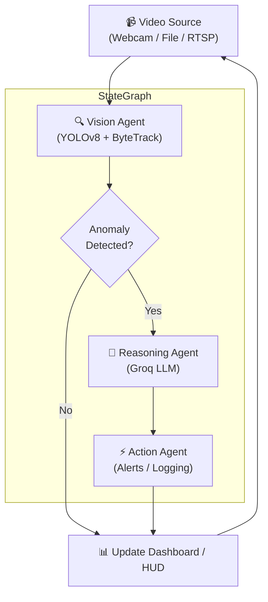

# 🛡️ AI-Powered Video Surveillance Agent System
[](https://www.fiverr.com/khalid_khan55)

An advanced, agentic video surveillance system combining **YOLOv8** for real-time tracking, rule-based heuristics for anomaly filtering, and a stateful **LangGraph** multi-agent pipeline powered by **Groq LLM** for threat reasoning and action planning. Includes a premium terminal HUD interface and a live Streamlit web dashboard.

---

## 👁️ System Overview & Architecture

The system optimizes speed and cost using a tiered agent architecture. The heavy computer vision model runs continuously on every frame, while the expensive LLM reasoning node is only triggered conditionally when potential security exceptions are flagged.



---

## ✨ Key Features

1. **Multi-Object Tracking (YOLOv8 + ByteTrack)**: Persistent tracking of people and vehicle objects with unique track IDs, trajectory calculations, and velocity mapping.
2. **Rule-Based Anomaly Detection Heuristics**:
   * **Crowd Formation**: Flags sudden gatherings exceeding a size threshold (e.g. >5 people).
   * **Loitering Detection**: Flags objects remaining static or dwelling in an area for too long.
   * **Speed Violations**: Flags objects moving at abnormally high velocities.
   * **Zone Intrusion**: Triggers critical alerts when subjects breach custom coordinate boundaries.
   * **Sudden Objects**: Detects new large static objects (e.g. abandoned bags).
3. **LangGraph StateGraph Orchestration**: Uses conditional router edges to bypass LLM calls during peaceful frames, decreasing latency and API token consumption.
4. **Groq LLM Reasoning**: Calls Llama-3 (or Mixtral) to perform high-level qualitative analysis of the scene, evaluate the threat level, and output security instructions.
5. **Simulated Sandbox Mode**: Automatically falls back to a simulated local reasoning engine if no Groq API Key is configured, allowing instant out-of-the-box local testing.
6. **Dual Display Interfaces**:
   * **OpenCV Matrix HUD**: Real-time camera overlay window with styled telemetry stats, bounding boxes, paths, and an active alerts console.
   * **Streamlit Web Dashboard**: High-quality dark UI web app displaying active streams, real-time counts, severity bar charts, and historical anomaly report search tools.

---

## 📂 Project Structure

```
video_surveillance_agent/
├── .env                          # Groq API Key and config environment vars
├── requirements.txt              # Project library dependencies
├── config.py                     # Centralized thresholds and zone configuration
├── main.py                       # CLI application with OpenCV HUD window
├── core/
│   ├── state.py                  # LangGraph SurveillanceState schema
│   ├── tracker.py                # YOLOv8 + ByteTrack tracking wrapper
│   └── anomaly_detector.py       # Rule-based mathematical anomaly engine
├── agents/
│   ├── vision_agent.py           # Node 1: Object & person tracking
│   ├── anomaly_agent.py          # Node 2: Security exception filter
│   ├── reasoning_agent.py        # Node 3: ChatGroq threat analyst
│   ├── action_agent.py           # Node 4: Logs compiler & alarm manager
│   └── graph.py                  # Multi-agent state graph compiler
├── dashboard/
│   └── app.py                    # Streamlit control panel app
└── logs/
    └── events.jsonl              # Serialized JSON Lines event history log
```

---

## 🚀 Getting Started

### 📋 Prerequisites
Make sure you have Python 3.8+ installed on your computer.

### 1. Clone & Set Up Directory
Navigate to your project folder:
```bash
cd video_surveillance_agent
```

### 2. Install Dependencies
Install the required packages using `pip`:
```bash
pip install -r requirements.txt
```

### 3. Configure the Environment
Open the `.env` file in the root directory:
```env
# Paste your Groq API key below. Get one at: https://console.groq.com
GROQ_API_KEY=gsk_your_groq_api_key_here

# Optional: customize model choice, source, or yolo size
GROQ_MODEL=llama-3.3-70b-versatile
VIDEO_SOURCE=0
YOLO_MODEL=yolov8n.pt
```
> [!NOTE]
> If you leave `your_groq_api_key_here` unchanged, the system runs in a smart local simulation mode so you can view all interfaces and see how the agent responds.

---

## 💻 Running the Interfaces

### Run the OpenCV Live Monitor
Launch the real-time CLI overlay viewer:
```bash
python main.py
```
* **Controls**: Press **`q`** on your keyboard while focusing the OpenCV window to exit.
* **Alternate Video Source**: Pass file paths or RTSP feeds directly:
  ```bash
  python main.py --source path/to/security_video.mp4
  ```

### Run the Web Dashboard
Launch the interactive Streamlit browser console:
```bash
streamlit run dashboard/app.py
```
* Once loaded, navigate to `http://localhost:8501` in your browser.
* Use the **Live Feed Monitor** tab to view your camera stream with interactive confidence sliders.
* Use the **Incident Analytics** tab to inspect historical charts and read case reports compiled by the Groq AI analyst.

---

## 🛠️ Configuration Details

All tracking criteria and alert parameters can be customized in the `config.py` file:
* `CROWD_THRESHOLD`: Group size that flags crowd warnings.
* `LOITER_FRAME_THRESHOLD`: Frame limit after which stationary targets flag loitering alerts.
* `SPEED_THRESHOLD`: Peak pixel movement distance before flagging speed violations.
* `RESTRICTED_ZONES`: Define polygons coordinates `[(x1,y1), (x2,y2)...]` to restrict entry areas.
